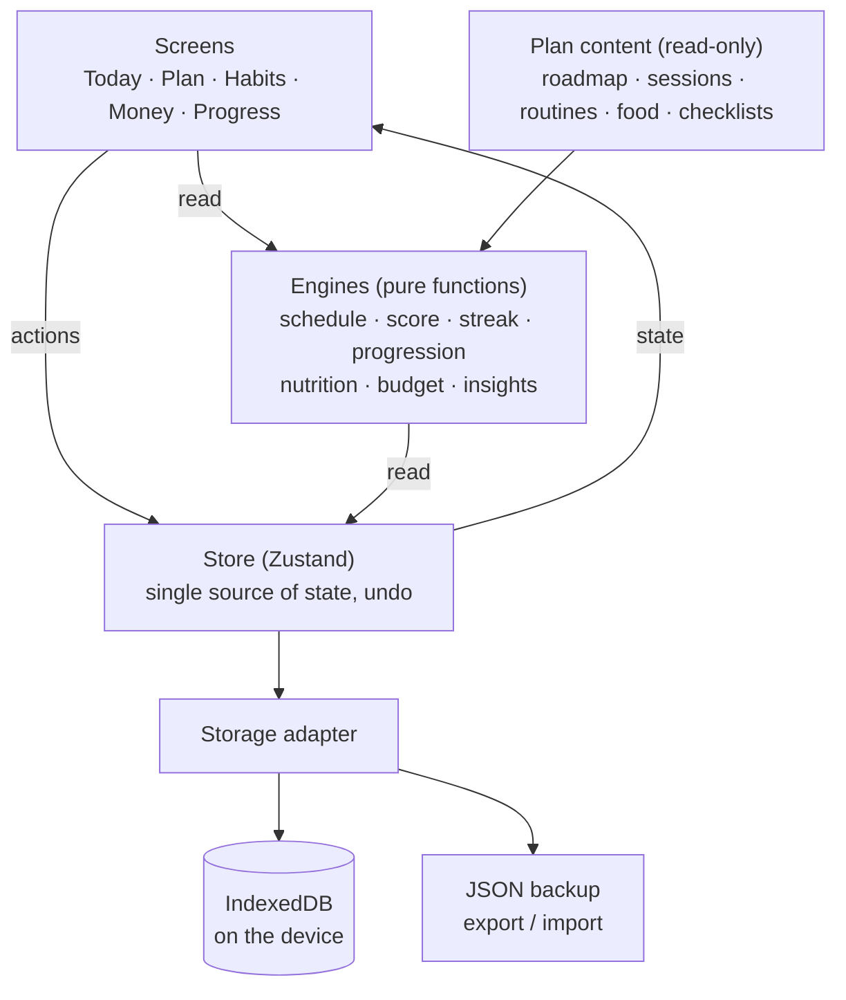

<div align="center">

# Runway OS

**A personal operating system for a 12-month runway model plan: training, habits, money and progress in one installable app.**


</div>

---

## Contents

- [Overview](#overview)
- [Features](#features)
- [Tech stack](#tech-stack)
- [Architecture](#architecture)
- [Getting started](#getting-started)
- [Available scripts](#available-scripts)
- [Project structure](#project-structure)
- [Data and privacy](#data-and-privacy)
- [Deployment](#deployment)
- [Install on a phone](#install-on-a-phone)
- [Testing](#testing)
- [Roadmap](#roadmap)
- [Documentation](#documentation)

## Overview

Runway OS turns a 12-month runway model plan into daily actions. It answers one question each morning,
*what do I do today?*, and then tracks whether it got done:

- which gym session or routine is due, with sets, reps and rest times;
- which habits are open, and how the streaks stand;
- how much money is safe to spend today;
- whether the body, face, walk and portfolio are actually improving month by month.

It is a mobile-first Progressive Web App: open the link, add it to the home screen, and it runs full screen,
offline, with its own icon. There is no account and no server: data stays on the device.

## Features

### Today
- Plan position (`Day 12 · Week 2 of 52 · Month 1`) and a daily score ring with streak and weekly focus
- Today's session picked from the week plan; a missed gym day moves the next session up in order
- One-tap habit tiles and counters for water, protein, steps and sleep, each with undo
- Money strip: spent today and **safe to spend per day** for the rest of the month
- Context cards that appear only when relevant: re-measure day, Sunday check, new month unlocked

### Plan
- **Roadmap**: 8 steps over 12 months, each unlocking in its month, with a clear *done when* check
- **Week**: Monday to Sunday split (Upper A, Lower A + Core, Recovery, Upper B, Lower B + Core, Cardio + Skills, Rest)
- **Workout logger**: warm-up, kg and reps per set, automatic rest timer, last session's numbers,
  next-weight suggestion and personal bests; progress is saved set by set and resumes after closing the app
- **Guided routines** with step timers: posture, runway walk, posing, skincare AM and PM, mobility
- **Food**: calorie and protein targets from body weight and type, veg and non-veg day plans, plate guide, shopping list
- **Checklists**: casting-ready, shoot day, 8-piece wardrobe, agency digitals, "is this agency real?"

### Habits
- Built-in habits from the plan plus custom ones (check, counter or number; daily, chosen weekdays or *X* times a week)
- Current and best streaks, a 12-week heatmap and a printable-style weekly tick sheet

### Money (₹ INR)
- Quick add in three taps: amount, category, save
- Monthly budgets per category with alerts at 80% and 100%
- Accounts (Cash, Bank, UPI, Card) with balances and transfers
- Recurring entries, savings goals and a **career investment** total for model-career spending
- Charts: spend by category, daily spend, income vs expense over 6 months

### Progress
- **Sunday check**: rate 10 areas from 1 to 10; the lowest becomes next week's focus
- Weekly log filled in automatically from daily data
- Measurements every 4 weeks, progress photos in 7 standard poses with a side-by-side compare slider
- Model card (height, measurements, shoe, hair, eyes) that can be saved as an image
- Rule-based insights, for example *"Protein hit only 3/7 days"* (no AI involved)

### Across the app
- Four-step onboarding, light, dark and automatic themes
- JSON backup export and import, with a monthly reminder
- Works offline after the first visit

## Tech stack

| Area | Choice |
|---|---|
| UI | React 18, TypeScript (strict) |
| Build | Vite 6 |
| State | Zustand, one store, every change undoable |
| Logic | Pure TypeScript engines: schedule, score, streak, progression, nutrition, budget, insights |
| Styling | Plain CSS with design tokens for light and dark themes, Poppins |
| Charts | Hand-written SVG: donut, bars, line, radar, heatmap, sparkline |
| Storage | IndexedDB behind a single storage adapter |
| Offline | Web app manifest and a service worker |
| Tests | Vitest |
| Hosting | Vercel (static) |

No backend, no analytics and no third-party runtime services apart from Google Fonts.

## Architecture



Design rules:

1. **Screens hold no business logic.** They read state, call engines and dispatch store actions.
2. **The store is the only place state changes.** Every record carries `updatedAt`; deletes are tombstones.
3. **Engines are pure functions** of data and a date, so every rule in the plan is unit-tested.
4. **Content is separate from data.** The plan can change without touching anything the user logged.
5. **One storage interface.** Screens never touch storage directly, so the backend can change later.

## Getting started

Requirements: **Node.js 20 or newer** and npm.

```bash
git clone https://github.com/Arunkumar2004/Habit_Tracker.git
cd Habit_Tracker
npm install
npm run dev
```

Open <http://localhost:5199>. The first screen is onboarding.

## Available scripts

| Command | Description |
|---|---|
| `npm run dev` | Start the development server on port 5199 |
| `npm run build` | Type-check and build the installable web app into `dist/` |
| `npm run preview` | Serve the production build locally |
| `npm test` | Run the full test suite once |
| `npm run typecheck` | Run the TypeScript compiler without emitting |
| `npm run build:artifact` | Build a single self-contained HTML file in `dist-artifact/` (optional, for a private claude.ai page) |
| `python scripts/make-icons.py` | Redraw the app icons in `public/icons/` (requires Pillow) |

## Project structure

```
.
├── index.html                  App shell: meta tags, manifest, fonts
├── public/                     Static files served as-is
│   ├── manifest.webmanifest    Install metadata
│   ├── sw.js                   Service worker (offline support)
│   └── icons/                  App icons (192, 512, maskable, Apple touch)
├── src/
│   ├── main.tsx                Boot: load storage, seed defaults, register the service worker
│   ├── types.ts                Data model for every collection
│   ├── app/                    Shell: tabs, routing, quick add, sheets, toasts
│   ├── store/                  Store, storage adapter, extension registry
│   ├── engines/                Business rules and their tests
│   ├── data/                   Plan content: roadmap, sessions, routines, food, checklists
│   ├── features/
│   │   ├── today/              Today and Habits
│   │   ├── plan/               Roadmap, week, workout logger, routines, food, lists
│   │   ├── money/              Overview, entries, budgets, goals, recurring, accounts
│   │   └── progress/           Progress, Sunday check, measurements, photos, model card,
│   │                           settings, onboarding
│   ├── ui/                     Shared components, icons, charts, confetti
│   ├── styles/                 Design tokens and base styles
│   └── lib/                    Dates, formatting, backup, image compression
├── scripts/                    Build helpers (single-file page, icons)
├── MD/                         Product blueprint and build notes
└── vercel.json                 Hosting configuration
```

## Data and privacy

- All entries are stored **only on the device**, in the browser's IndexedDB. Nothing is sent to a server.
- Data does **not sync between devices.** To move to a new phone, export a backup and import it there.
- **Back up regularly:** *Settings → Export backup* saves a `.json` file; *Settings → Import backup* restores it.
  The app reminds you once a month.
- Clearing the browser's site data for the app deletes all entries, so keep a recent backup.
- Progress photos are compressed on the device (about 150 KB each) before they are saved.

## Deployment

The app is a static site, configured for Vercel in [`vercel.json`](vercel.json).

**From GitHub (recommended):**

1. Sign in at [vercel.com](https://vercel.com) with GitHub.
2. Choose **Add New → Project** and import this repository.
3. Keep the detected settings (framework Vite, build `npm run build`, output `dist`) and select **Deploy**.

Every push to `main` then deploys automatically, and pull requests get preview links.

**From the command line:**

```bash
npx vercel          # preview deployment
npx vercel --prod   # production deployment
```

`vercel.json` also sets long-term caching for hashed assets, `no-cache` for the service worker so updates
reach users, and basic security headers.

## Install on a phone

| Platform | Steps |
|---|---|
| Android (Chrome) | Open the site → menu **⋮** → **Add to Home screen** or **Install app** |
| iPhone (Safari) | Open the site → **Share** → **Add to Home Screen** |

The app then opens full screen with its own icon and works without a connection after the first visit.

## Testing

```bash
npm test
```

144 tests cover the rules that matter most:

| Area | Examples |
|---|---|
| Schedule | Day, week and month numbers; missed session moves up; weekday and *X*-per-week habits |
| Score and streaks | Part credit for counters; unscheduled days do not break a streak |
| Progression | +2.5 kg when every set hits the top of the range; easy week every 8–10 weeks; personal bests |
| Nutrition | Calories from weight × 32 plus body-type adjustment; protein 1.6–2.0 g/kg; 2-weekly ±200 kcal check |
| Budget | Safe to spend per day; 80% and 100% alerts; recurring dates at month ends |
| Insights | Protein days hit, spend vs last month, re-measure due, backup reminder |
| Backup | Export → reset → import returns exactly the same data |
| Charts | Tick scales, label thinning, empty states |

## Roadmap

- Reminders (skincare, water, Sunday check)
- A weekly coach note generated from the week's data
- Step import from Google Fit and Apple Health
- Expense import from bank SMS and UPI statements
- Shareable before-and-after progress card
- Optional sync across devices

## Documentation

| Document | Contents |
|---|---|
| [`MD/Runway_OS_App_Blueprint.md`](MD/Runway_OS_App_Blueprint.md) | Product blueprint: screens, data model, rules, design system |
| [`MD/BUILD-BRIEF.md`](MD/BUILD-BRIEF.md) | Engineering notes: module ownership, contracts, store API, UI conventions |

---

<div align="center">

Built by **Arunkumar**. *Consistency beats intensity.*

</div>
